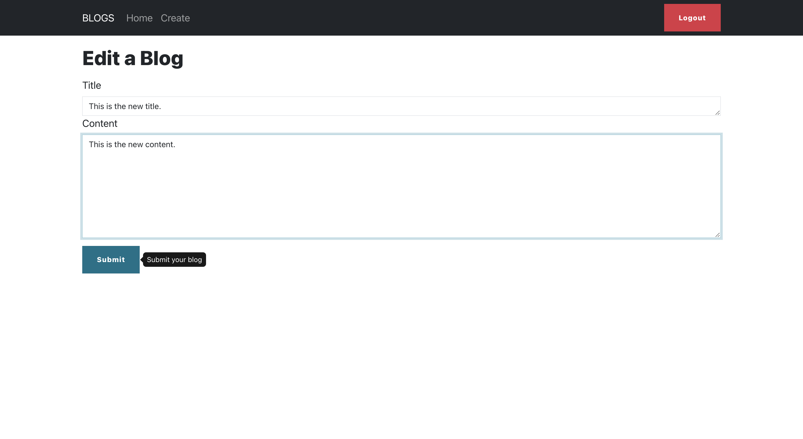

# Team GLHF - Iterations
Team Members: Hua Cong, Hanchen Zhang, Yufan Lu, Tsai-Chieh Lin
### Heroku Deployment:
Front-end: https://blogs-frontend-glhf.herokuapp.com/ \
Back-end: https://blogs-backend-glhf.herokuapp.com/

### GitHub Links:
Front-end: https://github.khoury.northeastern.edu/NEU-CS5610-FA22/Frontend-GLHF \
Back-end: https://github.khoury.northeastern.edu/NEU-CS5610-FA22/Backend-GLHF

### Requirements: 
1. UI with data by at least 2 CRUD operations for at least one database table. \
=> We have CRUD operations for blog and comment.
2. At least 3 different UI routes. \
=> We have blog list page, single blog page, create/update blog page, comments page, and create/update comment page.
3. At least one Bootstrap UI component not featured in the demo application. \
=> We utilized OverlayTrigger and Tooltip on create blog page which tells user what the submit button does
4. Different layout and design from the demo application. \
=> Achieved. Many design changes and components adding, see screen shots below.
5. At least one of the 3rd party library for React, GraphQL, and Redux. \
=> We leveraged Material UI to implement autocomplete search bar on home page.

### Iteration 1  
We built the basic web page and implemented the front-end and back-end logic of retrieving blogs, creating blogs, deleting blogs, and updating blogs. 

#### Contribution: 
Hua Cong:
1. Implemented the front-end and back-end for updating blogs.
2. Implemented the back-end for creating a blog.
3. Collaborated with Yufan Lu to build the front-end for creating a blog page.
4. Collaborated with Yufan Lu to deploy the database to MongoDB Atlas.
5. Utilized Insomnia to test back-end APIs for creating and updating a blog. 

Hanchen Zhang:
1. Implemented home page, navigation bar, app.js and add style.
2. Implemented retrieve blog and blog list's front-end and back-end.
3. Deployed web page on Heroku.
4. Helped teammates to solve merge conflict issues and git problems. 

Yufan Lu:
1. Took part in configuring development environment.
2. Wrote Blog Create/Update function with Hua.
3. Tested the basic functions and recorded screenshots.
4. Helped set up github multi-branch environment.
5. Helped set up mongodb cloud service. 

Tsai-Chieh Lin:
1. Designed and implemented the front-end blog delete component.
2. Designed and implemented the back-end blog delete logic and tested the functionality with Postman.
3. Collaborated with teammate Hua on merging and solving conflict through source control tool GitHub. 

### Iteration 2 
We added an individual blog page with a comment session underneath. We implemented comment CRUD operations in the backend so users can add and manage their comments. We also used the Material UI library to create a search box that suggests possible titles that users want to search based on their input text and autocompletes the search box if users click on one of the suggestions. Finally, we added CSS and other HTML components to make the web page looks more user-friendly. 

#### Contribution: 
Hua Cong:
1. Implemented the front-end and back-end for the single blog page.
2. Utilized Insomnia to test back-end APIs for getting a blog by id.
3. Wrote README for Iteration 2. 

Hanchen Zhang:
1. Added autocomplete search box using Material UI library and implemented algorithms to retrive all blog titles
2. Added css to the web page to make the home page and navigation bar more stylish 

Yufan Lu:
1. Designed the front-end pages for Comment module.
1. Wrote the CRUD functions for Comment module with Tsai-Chieh.
2. Tested back-end API functionalities with Insomnia. 

Tsai-Chieh Lin:
1. Developed comment CRUD function with YuFan.
2. Updated README 

### Iteration 3 
We fixed some functional issues on the web page and changed CSS and added components to the web page so every session has a consistent style. We also add a tooltip component on UI that is not featured in the demo. 

#### Contribution:  
Hua Cong:
1. Updated the single blog page's CSS to make it looks more user-friendly.
2. Updated the create blog page's form to make it looks more user-friendly.
3. Collected screenshots and helped write README for Iteration 3. 

Hanchen Zhang:
1. Add style and more components to comment, individual blog page and home page and remove component that we no longer want to implement.
2. Fix issue that user can only comment on their own post.
3. Fix issue that blog content not showing new line.
4. Fix search index issue on MongoDB Atlas so search works on Heroku.
5. Adding blog data to MongoDB atlas and deployed final web page on Heroku. 

Yufan Lu:
1. Helped test the searching functionality with index(blog_title) on mongodb. 

Tsai-Chieh Lin:
1. Added one bootstrap component that is not featured in the demo app(tooltip component).
2. Tagged Iteration on github 

### Screenshots: 
#### Homepage:

 
#### Single Blog Page:
 
#### Create a Blog:
 
#### Edit a Blog:
 
#### Delete a Blog:
 
#### Comments and Delete a Comment:
 
#### Create a Comment:
 
#### Edit a Comment:
 
#### Autocomplete Search Bar:
 
#### Extra Bootstrap UI Component:
 